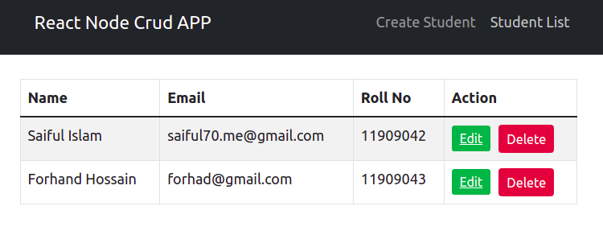
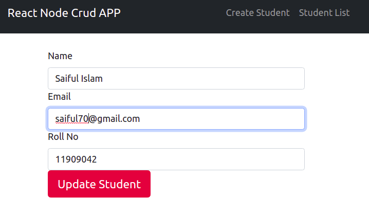
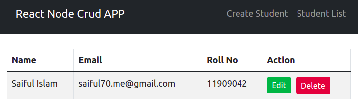

# React Node(MERN) CRUD App

A basic CRUD app created by react and node.

## How to use/install(Step by step):

- First start mongodb server in your local machine
- Start Frontend Server
  ```bash
  git clone https://github.com/saiful-70/react-node-crud.git
  cd react-node-crud
  npm install
  npm start
  ```
- Start Backend Server
  ```bash
  cd backend
  npm install
  npm start
  ```
- Open http://localhost:3000 to view it in the browser.

## Visualization:

- ### Create a data
  
- ### See Lists
  
- ### Update a data
  
- ### After delete a data
  
